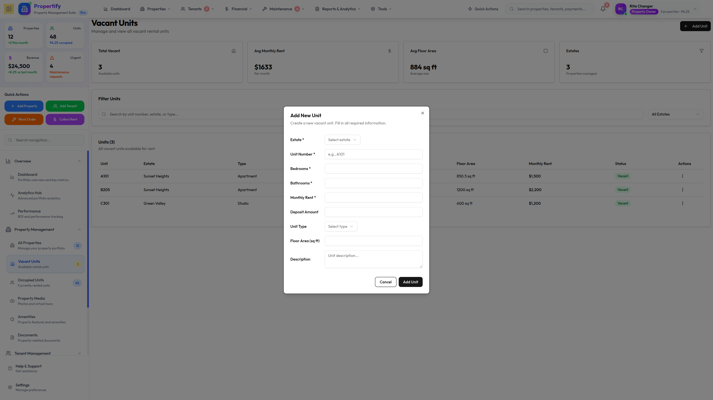
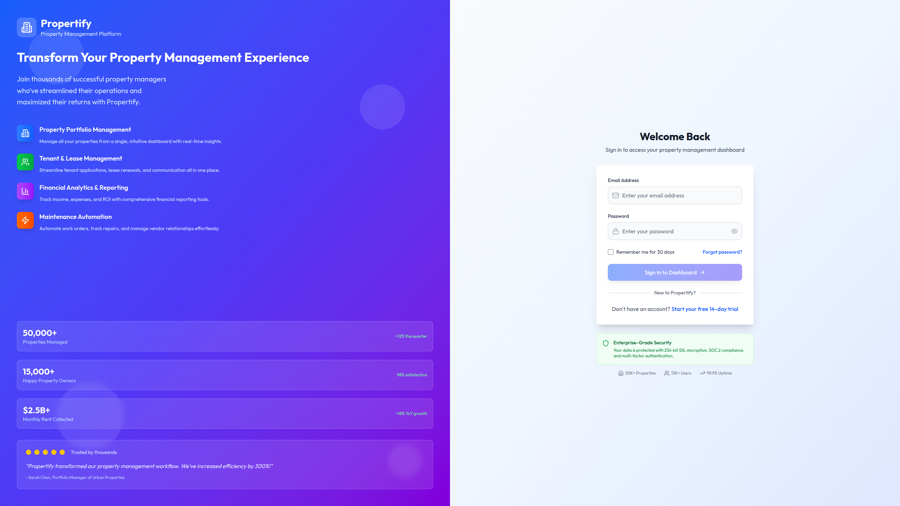
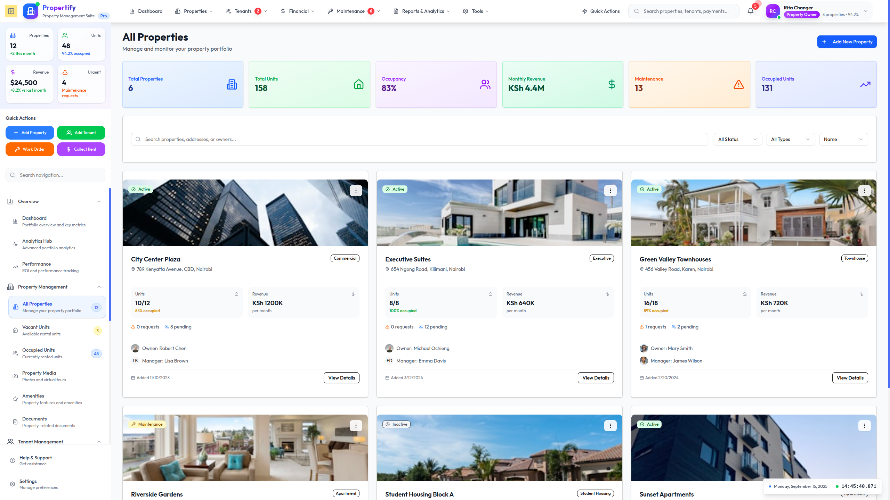
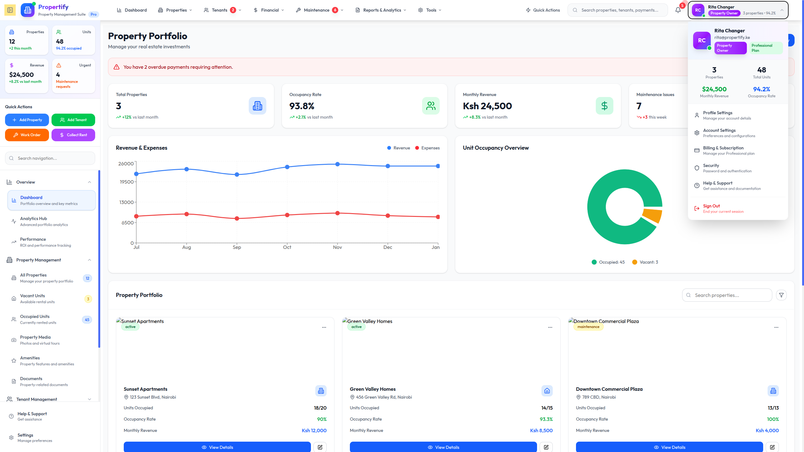

# 🏢 Propertify Frontend

[](https://reactjs.org/)
[](https://www.typescriptlang.org/)
[](https://vitejs.dev/)
[](https://tailwindcss.com/)
[](https://recharts.org/)
[](https://ui.shadcn.com/)


A modern, comprehensive real estate management platform designed for property owners, managers, tenants, and accountants in Kenya and beyond. Built with React 18, TypeScript, and Vite for optimal performance and developer experience.

## 🚀 Features

### 🏠 **Estate Management**
- **Multi-Estate Portfolio**: Manage multiple properties from a centralized dashboard
- **Unit Tracking**: Monitor individual units with real-time occupancy status
- **Property Analytics**: View occupancy rates, revenue analytics, and performance metrics
- **Estate Documentation**: Store and manage property documents securely

#### Layout


#### Welcome page



#### Units page



#### Property Page



### Dashboard page


### 👥 **User Management**
- **Role-Based Access Control**: Support for owners, managers, tenants, and accountants
- **Multi-Role Support**: Users can have different roles across different properties
- **Profile Management**: Comprehensive user profiles with contact information
- **Authentication**: Secure login with JWT tokens and role-based routing

### 🏠 **Tenant Operations**
- **Online Applications**: Digital tenant application process with document uploads
- **Lease Management**: Digital lease agreements with e-signatures
- **Rent Payments**: Integrated M-Pesa payments and multiple payment methods
- **Maintenance Requests**: Submit and track maintenance issues with priority levels
- **Tenant Dashboard**: Personalized dashboard with payment history and lease details

### 💰 **Financial Management**
- **Automated Invoicing**: Generate monthly rent invoices automatically
- **Payment Processing**: Support for M-Pesa, bank transfers, and cash payments
- **Receipt Generation**: Automated receipt generation with QR codes for verification
- **Financial Reporting**: Comprehensive reports for revenue, expenses, and collection rates
- **Expense Tracking**: Monitor estate maintenance and operational costs

### 🔧 **Maintenance & Operations**
- **Request Management**: Track maintenance requests from submission to completion
- **Priority System**: Categorize requests by urgency (low, medium, high, urgent)
- **Cost Tracking**: Monitor estimated vs. actual maintenance costs
- **Service Provider Integration**: Assign tasks to internal staff or external contractors

### 📊 **Analytics & Reporting**
- **Dashboard Analytics**: Real-time insights into property performance
- **Revenue Reports**: Monthly and yearly revenue analysis
- **Occupancy Trends**: Track vacancy rates and tenant turnover
- **Collection Reports**: Monitor rent collection efficiency
- **Expense Analysis**: Breakdown of operational costs by category

### 📱 **Communication**
- **Multi-Channel Notifications**: Email, SMS, and WhatsApp integrations
- **Automated Reminders**: Rent due reminders and payment confirmations
- **System Notifications**: In-app notifications for important updates
- **Audit Trail**: Complete activity logs for transparency

## 🛠 Tech Stack

- **Frontend Framework**: React 18 with TypeScript
- **Build Tool**: Vite for lightning-fast development and builds
- **Styling**: Tailwind CSS for responsive, utility-first design
- **State Management**: React Query for server state + Zustand for client state
- **Routing**: React Router v6 with protected routes
- **Forms**: React Hook Form with Zod validation
- **UI Components**: Headless UI + custom component library
- **Icons**: Lucide React for consistent iconography
- **Charts**: Recharts for data visualization
- **Date Handling**: Date-fns for date manipulation
- **HTTP Client**: Axios with interceptors for API communication

## 📋 Prerequisites

Before you begin, ensure you have the following installed:
- **Node.js** (v18.0 or higher)
- **npm** (v8.0 or higher) or **yarn**
- **Git** for version control

## 🚀 Quick Start

1. **Clone the repository**
   ```bash
   git clone https://github.com/Ritahchanger/propertify_frontend.git
   cd propertify_frontend
   ```

2. **Install dependencies**
   ```bash
   npm install
   # or
   yarn install
   ```

3. **Environment Setup**
   ```bash
   cp .env.example .env
   ```
   
   Update the `.env` file with your configuration:
   ```env
   VITE_API_BASE_URL=http://localhost:5000/api
   VITE_APP_NAME=Propertify
   VITE_MPESA_CONSUMER_KEY=your_mpesa_consumer_key
   VITE_MPESA_CONSUMER_SECRET=your_mpesa_consumer_secret
   ```

4. **Start the development server**
   ```bash
   npm run dev
   # or
   yarn dev
   ```

5. **Open your browser**
   Navigate to `http://localhost:5173` to see the application running.


## 🔧 Available Scripts

```bash
# Development
npm run dev          # Start development server
npm run dev:host     # Start dev server accessible on network

# Building
npm run build        # Build for production
npm run preview      # Preview production build locally

# Code Quality
npm run lint         # Run ESLint
npm run lint:fix     # Fix ESLint issues automatically
npm run type-check   # Run TypeScript compiler check

# Testing
npm run test         # Run unit tests
npm run test:ui      # Run tests with UI
npm run coverage     # Generate test coverage report
```

## 🌟 Key Features Walkthrough

### **Owner Dashboard**
- Portfolio overview with key metrics
- Revenue analytics and trends
- Estate performance comparisons
- Expense tracking and budgeting

### **Manager Interface**
- Estate-specific management tools
- Tenant application approvals
- Maintenance request oversight
- Financial reporting for assigned estates

### **Tenant Portal**
- Personal dashboard with lease information
- Online rent payment with M-Pesa integration
- Maintenance request submission
- Payment history and receipts download

### **Accountant Tools**
- Comprehensive financial reporting
- Invoice generation and management
- Payment reconciliation
- Expense categorization and analysis

## 🔐 Authentication & Authorization

The application implements a robust authentication system:
- **JWT-based authentication** with refresh tokens
- **Role-based access control** (RBAC) for different user types
- **Protected routes** based on user permissions
- **Session management** with automatic token refresh

## 📱 Responsive Design

Propertify is built with mobile-first approach:
- **Fully responsive** design that works on all devices
- **Touch-friendly** interfaces for mobile users
- **Progressive Web App** capabilities for offline access
- **Optimized performance** for slower network connections

## 🎨 Design System

The application follows a consistent design system:
- **Color Palette**: Professional blue and gray tones
- **Typography**: Inter font family for readability
- **Components**: Reusable UI components with variants
- **Icons**: Consistent iconography using Lucide React

## 🚀 Performance Optimizations

- **Code Splitting**: Route-based code splitting for faster initial loads
- **Lazy Loading**: Components and images loaded on demand
- **Memoization**: React.memo and useMemo for expensive computations
- **Bundle Analysis**: Webpack bundle analyzer for optimization insights

## 🔧 Configuration

### **Vite Configuration**
The project uses Vite for optimal development experience with:
- Hot Module Replacement (HMR)
- TypeScript support out of the box
- Optimized production builds
- Plugin ecosystem integration

### **Tailwind CSS**
Custom Tailwind configuration includes:
- Custom color palette
- Extended spacing and sizing
- Custom components and utilities
- Responsive design tokens

## 📊 Environment Variables

| Variable | Description | Required |
|----------|-------------|----------|
| `VITE_API_BASE_URL` | Backend API base URL | ✅ |
| `VITE_APP_NAME` | Application name | ✅ |
| `VITE_MPESA_CONSUMER_KEY` | M-Pesa consumer key | ✅ |
| `VITE_MPESA_CONSUMER_SECRET` | M-Pesa consumer secret | ✅ |
| `VITE_ENVIRONMENT` | Environment (dev/prod) | ❌ |

## 🧪 Testing

The project includes comprehensive testing setup:
- **Unit Tests**: Component and utility function tests
- **Integration Tests**: API integration and user flow tests
- **E2E Tests**: End-to-end testing with Playwright
- **Coverage Reports**: Code coverage tracking

```bash
npm run test              # Run all tests
npm run test:watch        # Run tests in watch mode
npm run test:coverage     # Generate coverage report
```

## 📦 Deployment

### **Production Build**
```bash
npm run build
```

### **Docker Deployment**
```dockerfile
FROM node:18-alpine
WORKDIR /app
COPY package*.json ./
RUN npm ci --only=production
COPY . .
RUN npm run build
EXPOSE 3000
CMD ["npm", "run", "preview"]
```

### **Environment-Specific Builds**
```bash
# Staging
npm run build:staging

# Production
npm run build:production
```

## 🤝 Contributing

We welcome contributions! Please follow these steps:

1. **Fork the repository**
2. **Create a feature branch**
   ```bash
   git checkout -b feature/amazing-feature
   ```
3. **Make your changes** and ensure tests pass
4. **Commit your changes**
   ```bash
   git commit -m 'Add some amazing feature'
   ```
5. **Push to the branch**
   ```bash
   git push origin feature/amazing-feature
   ```
6. **Open a Pull Request**

### **Coding Standards**
- Follow TypeScript best practices
- Use meaningful variable and function names
- Write comprehensive tests for new features
- Follow the existing code style and conventions
- Update documentation for any new features

## 📝 License

This project is licensed under the MIT License - see the [LICENSE](LICENSE) file for details.

## 👥 Team

- **Lead Developer**: [Rita Changer](https://github.com/Ritahchanger)
- **Backend Integration**: API integration with PostgreSQL database
- **UI/UX Design**: Modern, user-friendly interface design

## 📞 Support

For support and questions:
- 📧 **Email**: support@propertify.ke
- 📱 **WhatsApp**: +254 113 174493
- 🐛 **Issues**: [GitHub Issues](https://github.com/Ritahchanger/propertify_frontend/issues)

## 🗺 Roadmap

### **Phase 1: Core Features** ✅
- User authentication and authorization
- Basic estate and unit management
- Tenant applications and lease management
- Payment processing with M-Pesa

### **Phase 2: Advanced Features** 🚧
- Advanced analytics and reporting
- Mobile app development
- WhatsApp integration for notifications
- Multi-language support (Swahili, English)

### **Phase 3: Enterprise Features** 📋
- Multi-tenant architecture
- Advanced role permissions
- API integrations with accounting software
- Automated lease renewals

## 📈 Metrics

- **Performance Score**: 95+ on Lighthouse
- **Accessibility Score**: AA compliance
- **Bundle Size**: < 500KB gzipped
- **Test Coverage**: 85%+

---

<div align="center">
  <strong>Made with ❤️ for the Kenyan Real Estate Market</strong>
  <br>
  <sub>Empowering property management through technology</sub>
</div>